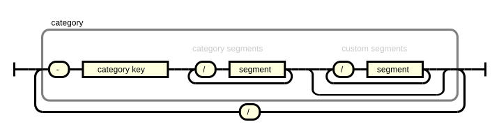

# PAC-CAT

## `PAC-CAT` in a Nutshell

`PAC-CAT` augments the [PAC-ID](https://github.com/ApiniLabs/pac-id) specification by defining

- how to structure the `identifier` for different entity categories.
- shorthand rules for omitting `id segment key`s to reduce URL length
- identify the issuing system

Example for a device:
```
HTTPS://PAC.METTORIUS.COM/-MD/240:BAL500/21:210263/8008:20230205/8009:ABC
```

## Introduction

`PAC-ID`s might be used to identify different categories of entities. Entities of different categories are treated differently (e.g. a substance can be aliquoted, while a device cannot; a method instructs a device what to do, while a run documents what was done).

While the basic specification for the `PAC-ID` has been intentionally kept minimal, `PAC-ID`s are much more powerful if they are issued both, systematically and with a some verbosity. `PAC-CAT` specifies how to structure the `identifier` of the `PAC-ID`, to fulfil these goals:

- Verbose enough so that it is always clear
  - to what entity the `PAC-ID` is pointing to
  - what the uniqueness scope is
- Reliable and easy for service discovery with [PAC-ID Resolver](https://github.com/ApiniLabs/pac-id-resolver)

> [!IMPORTANT]
> PAC-CAT is not a data record - It is not the intention to fully describe an entity with these categorization.

## Specification

> [!NOTE]
> While it is RECOMMENDED to use PAC-CAT to structure `PAC-ID`s, doing so is optional. A `PAC-ID` can be valid, without following this specification.

### Structure of the `identifier`

The `PAC-ID`s `identifier` MUST be structured like this:


The first `id segment` MUST by a `category key`.
The `category key` MUST start with a `-`, followed by the at least one letter.
`id segments` which are not `category key`s MUST NOT start with '-'.

Example of a balance:

```
HTTPS://PAC.METTORIUS.COM/-MD/240:BAL500/21:210263/8008:20230205/8009:ABC
                             |category segments   |custom segments       |
                          ^ category key
```

#### Concatenate a second category to identify the issuing system

Imagine a `PAC-ID` that points to a result set of a device. We’d usually want to know on which device that result was created. We MAY simply concatenate a second category (in this case a material category to a data category):

Example:

```
HTTPS://PAC.METTORIUS.COM/-DR/240:123ABC/8008:20230205/-MD/240:BAL500/21:210263
                         | primary category           | issuing system
```

The advantage of this is that it allows resolving device related attributes and services (e.g. device operation manual, …) via the same coupling table information entries also used for `PAC-ID`s relating to a device.

The category of the item the `PAC-ID` is referring to, MUST be the first `category`.
The second category, if added, MUST identify the issuing system.

> [!NOTE]
> The same mechanism MAY also be used after a derivation namespace segment (`+<namespace>`), to identify the issuing system used for that specific derivation. See [Identifying the issuing system of a derivation](#identifying-the-issuing-system-of-a-derivation).

### Predefined Categories
The following predefined categories MUST be used if applicable.
Custom categories MAY be used if no suitable predefined category is available. _Use this as a last resort._

Mandatory `category segments`s are marked with * and in **boldface**. They MUST be used.
The other `category segments` SHOULD be added if they are available.
The order SHOULD be preserved, even if optional `category segments` are omitted.

If needed, `custom segment`s MAY be added. If so, they MUST be placed after the recommended `category segments`.


#### Main Category *Materials*
Materials are physical entities, that can be uniquely identified.

|Description | `category key` | `category segments`|
|:--- | :------------: | :--- |
| **Device** (Or equipment, apparatus, appliance, instrument and the like)<br>*A Device is a uniquely identifiable item, non-aliquotable and not dividable.* | **`-MD`**| **`240` (Model&nbsp;code)** * <br> `21` (Serial&nbsp;number) |
| **Substance** (Or source material, aliquot, sample, product and the like)<br>*A Substance is a uniquely identifiable item, aliquotable and/or dividable.*|**`-MS`**| **`240` (Product&nbsp;number)**&nbsp;* <br>`10` (Batch number)<br>`20` (Container size)<br>`21` (Container&nbsp;number)<br>`250` (Aliquot) |
| **Consumable**<br>*Consumables are typically bulk goods with limited lifespan. A Consumable is an item with a uniquely identifiable type and typically countable.*|**`-MC`** | **`240` (Product&nbsp;code)**&nbsp;*<br>`10` (Batch&nbsp;number)<br>`20` (Packaging size)<br>`21` (Serial&nbsp;number)<br>`250` (Aliquot)    |
| **Misc**<br>*Anything that doesn’t fit other material types – **ideally never used**.*|**`-MX`**| **`240` (Product&nbsp;code)**&nbsp;*<br>`10` (Batch&nbsp;number)<br>`20` (Packaging size)<br>`21` (Serial number)<br>`250` (Aliquot)    |

#### Main Category *Data*
Data refers to recorded information  — either digital or analog.

|Description | `category key` | `category segments`|
|:--- | :------------: | :--- |
| **Result** (Or completed run data, report, certificate of analysis (CoA) or the like)<br>*A Result is data that is a direct result of a completed run of a method.*|**`-DR`**| **`21` (ID)**&nbsp;*|
| **Method** (Or run configuration, recipe, SOP and the like)<br>*A Method is a definition of a certain process or workflow.*|**`-DM`**| **`21` (ID)**&nbsp;*|
| **Calibration** (Or a basic configuration.)<br>*A Calibration is changeable data that is used as a basis for running a method that creates progress data and/or result data.* |**`-DC`**| **`21` (ID)**&nbsp;*|
| **Progress** (Or status update, live data or the like)<br>*Progress data is of time-limited validity occurring while a method is executed.*|**`-DP`**| **`21` (ID)**&nbsp;*|
| **Static** (Or metadata, datasheet, master data, physical properties or the like.)<br>*Static data is unchangeable and universally true.*|**`-DS`**| **`21` (ID)**&nbsp;*|
| **Misc** <br>*Anything that doesn’t fit other data types*– **ideally never used**|**`-DX`**| **`21` (ID)**&nbsp;*|

#### Main Category *Processors*
Processors are specific systems under the control of the issuer that assign and manage materials or data.

|Description | `category key` | `category segments`|
|:--- | :------------: | :--- |
| **Software**<br>*Software are systems which generate, transform or store data.* <br><br>**Note**: Instruments often incorporate such functionality. In these cases it is RECOMMENDED to prioritize the material aspect of such instruments and use category `-MD`. | **`-PS`** | **`21`(Processor&nbsp;instance)**&nbsp;* <br> `240` (Processor&nbsp;code)|
| **Misc** <br>*Anything that doesn’t fit other processor types*– **ideally never used**| **`-PX`** | **`21`(Processor&nbsp;instance)**&nbsp;* <br> `240` (Processor&nbsp;code) |

#### Main Category *Misc*
This category is for anything that doesn't fit into other main categories.
|Description | `category key` | `category segments`|
|:--- | :------------: | :--- |
| **Misc**<br />*Generic fallback category* – **ideally never used**|**`-X`**| **`21` (ID)**&nbsp;*|


### Short Notation
In oder to reduce the number of characters a short form MAY be used by omitting the `id segment key`s, like this:.

```
HTTPS://PAC.METTORIUS.COM/-MD/BAL500/210263/8008:20230205
```

The short notation omits the keys for segments of each category. Keys are implicitly assigned based on the recommended segment order above, until an explicit key that differs is reached or an `id segment` starting with `-` is reached. Explicit keys MAY be used along implicit ones, as long as the order of segments is matched.

e.g. for ``HTTPS://PAC.METTORIUS.COM/-MD/240:BAL500/210263/8008:20230205``, `210263` is still regarded to have the implicit key `21`. For ``HTTPS://PAC.METTORIUS.COM/-MD/240:BAL500/8008:20230205/210263`` we can’t auto-assign a key for `210263` as it is preceded by a `id segment` with an explicit key. `210263` is therefore interpreted as a normal `id segment` without `id segment key`.


### Segments added via a derivation namespace (`+`)

A `PAC-ID` MAY be extended by a third party using a **derivation namespace segment** (`+<namespace>`), as defined in the [PAC-ID specification](https://github.com/ApiniLabs/PAC-ID). Where `PAC-CAT` is used, any `category segment`s that follow a `+<namespace>` marker MUST be treated as further `category segment`s of the **primary category** — they MUST NOT start a new category.

Example:
```
HTTPS://PAC.OMNIZYME.COM/-MS/240:AMYLASE/10:AB9876/20:500ML/21:9876/+ACMELABS.COM/250:1
                         | primary category                        | added by ACMELABS.COM
```

Here, `250:1` (Aliquot) is a `category segment` of the `-MS` primary category, even though it was added by `ACMELABS.COM` rather than the original issuer, `OMNIZYME.COM`.

A `+<namespace>` marker does not interrupt the implicit key sequence described in [Short Notation](#short-notation): only an explicit key that differs from the recommended order, or an `id segment` starting with `-`, breaks it. In the following example, since  `240`, `10`, `20`, `21` above were given in the recommended order, the following `category segment` in the 'ACMELABS.COM' namespace still carries the implicit key `250` and MAY be written without it:

```
HTTPS://PAC.OMNIZYME.COM/-MS/240:AMYLASE/10:AB9876/20:500ML/21:9876/+ACMELABS.COM/1
```

#### Identifying the issuing system of a derivation

As with the primary category (see [Concatenate a second category to identify the issuing system](#concatenate-a-second-category-to-identify-the-issuing-system)), a second category MAY be concatenated after the `category segment`s that follow a `+<namespace>` marker, to identify the **issuing system** that party used to perform this derivation. At most one such issuing-system category MAY be added per `+<namespace>` block. It MUST be placed after that block's own `category segment`s, and any `category segment` starting with `-` in that position MUST be interpreted as this issuing-system category rather than the start of a new, unrelated category.

Where multiple derivation namespace segments are chained, each `+<namespace>` block MAY carry its own issuing-system category, scoped only to that block.

Example:

```
HTTPS://PAC.OMNIZYME.COM/-MS/240:AMYLASE/10:AB9876/20:500ML/21:9876/+ACMELABS.COM/250:1/-PS/240:ALIQUOT-TRACKER
                         | primary category                        | added by ACMELABS.COM  | issuing system for this derivation
```

Here, `250:1` was added by `ACMELABS.COM` via a derivation namespace segment. `-PS/240:ALIQUOT-TRACKER` identifies the system `ACMELABS.COM` used to create that aliquot — it is not attributed to `OMNIZYME.COM`, the original issuer, nor does it start a new category for the primary entity.


### Examples:
| **Entity Description** | **PAC-ID** | **Note** |
|------------------------|------------|----------|
| Production record managed in Fluidics360 ERP test instance at Mettorius | `HTTPS://PAC.METTORIUS.COM/-DR/21:12345/-PS/240:FLUIDICS360/21:TST` | `12345` is the ID assigned by the ERP; `TST` refers to the test instance. |
| Production record managed in the only Fluidics360 system at Mettorius | `HTTPS://PAC.METTORIUS.COM/-DR/21:12345/-PS/240:FLUIDICS360` | `12345` assigned by Fluidics360; single instance assumed, so `TST` omitted. |
| Instrument by Mettorius | `HTTPS://PAC.METTORIUS.COM/-MD/240:BAL500/21:12345` | Mettorius produces instruments; adding an issuing system would not help with routing. |
| Calibration managed in the "ACME" tenant of "EosTec"`s SaaS system "Aurora" | `HTTPS://PAC.EOSTEC.COM/-DC/21:12345/-PS/240:AURORA/21:ACME` | `12345` assigned by Aurora; `ACME` is the tenant name. |
| Pencil used at "ACME". For stationery, they use an Excel-based asset list on ShareDot | `HTTPS://PAC.ACME.COM/-MC/240:EDELWEISS-3B/21:1234/-P/240:SHAREDOT/21:ASSETS.XLS` | `1234` is the ID given in `ASSETS.XLS` |
| Beehive of the ACME company. Tracked in Fluidics360 Asset Management | `HTTPS://PAC.ACME.COM/-MD/240:BEEHIVE/21:1234/-P/240:FLUIDICS360` | `1234` is the asset number assigned by SAP. |
| Result generated by BAL-500 balance with serial X78767 | `HTTPS://PAC.METTORIUS.COM/-DR/21:1234/-MD/240:BAL-500/21:X78767` | `1234` is the result ID; the issuing system is the balance itself. |
| Result managed by Mettorius LabCross software | `HTTPS://PAC.METTORIUS.COM/-DR/21:1234/-PS/240:LABCROSS` | `1234` is the result ID assigned by LabCross. |
| Aliquot of Amylase from OmniZyme, aliquoted by ACME Labs | `HTTPS://PAC.OMNIZYME.COM/-MS/240:AMYLASE/10:AB9876/20:500ML/21:9876/+ACMELABS.COM/250:1` | `250:1` (Aliquot) was added by `ACMELABS.COM` via a derivation namespace segment, and is interpreted as a `category segment` of the `-MS` primary category. |
| Same aliquot, using short notation | `HTTPS://PAC.OMNIZYME.COM/-MS/240:AMYLASE/10:AB9876/20:500ML/21:9876/+ACMELABS.COM/1` | The `250` key is omitted; `1` still carries the implicit key `250` since the preceding `category segment`s follow the recommended order. |
| Same aliquot, with the system ACME Labs used to create it | `HTTPS://PAC.OMNIZYME.COM/-MS/240:AMYLASE/10:AB9876/20:500ML/21:9876/+ACMELABS.COM/250:1/-PS/240:ALIQUOT-TRACKER` | `-PS/240:ALIQUOT-TRACKER` identifies the issuing system for this derivation only; it is scoped to the `ACMELABS.COM` namespace, not to `OMNIZYME.COM`. |
| Result managed by Mettorius LabCross software, later Recalcualted by ACMELABS | `HTTPS://PAC.METTORIUS.COM/-DR/21:1234/-PS/240:LABCROSS/+ACMELABS.COM/RECALC:1` | `-PS/240:LABCROSS` is the issuing system. `RECALC:1` was appended afterwards by `ACMELABS.COM` via a derivation namespace segment; it still belongs to the `-DR` primary category, not to the issuing system, even though it is placed after it. |


## Terminology Used

The key words "MUST", "MUST NOT", "REQUIRED", "SHALL", "SHALL NOT", "SHOULD", "SHOULD NOT", "RECOMMENDED", "MAY", and "OPTIONAL" in this document are to be interpreted as described in [RFC 2119](https://www.ietf.org/rfc/rfc2119.txt) "Key words for use in RFCs to Indicate Requirement Levels".

## FAQ

See [here](faq.md).

## License

Shield: [![CC BY-SA 4.0][cc-by-sa-shield]][cc-by-sa]

This work is licensed under a
[Creative Commons Attribution-ShareAlike 4.0 International License][cc-by-sa].

[![CC BY-SA 4.0][cc-by-sa-image]][cc-by-sa]

[cc-by-sa]: http://creativecommons.org/licenses/by-sa/4.0/
[cc-by-sa-image]: https://licensebuttons.net/l/by-sa/4.0/88x31.png
[cc-by-sa-shield]: https://img.shields.io/badge/License-CC%20BY--SA%204.0-lightgrey.svg#


