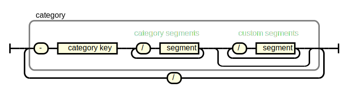

# PAC-CAT

## `PAC-CAT` in a Nutshell

`PAC-CAT` augments the [PAC-ID](https://github.com/ApiniLabs/pac-id) specification by defining
- how to structure the `identifier` for different entity categories. 
- shorthand rules for omitting `id segment key`s to reduce URL length
- identify the issuing system 
 
Example for a device:
```
HTTPS://PAC.METTORIUS.COM/-MD/240:BAL500/21:210263/8008:20230205/8009:ABC
```

## Introduction

`PAC-ID`s might be used to identify different categories of entities. Entities of different categories are treated differently (e.g. a substance can be aliquoted, while a device cannot; a method instructs a device what to do, while a run documents what was done).

While the basic specification for the `PAC-ID` has been intentionally kept minimal, `PAC-ID`s are much more powerful if they are issued both, systematically and with a some verbosity. `PAC-CAT` specifies how to structure the `identifier` of the `PAC-ID`, to fulfil these goals:

- Verbose enough so that it is always clear
  - to what entity the `PAC-ID` is pointing to
  - what the uniqueness scope is
- Reliable and easy for service discovery with [PAC-ID Resolver](https://github.com/ApiniLabs/pac-id-resolver)


## Specification
> **Note**: While it is RECOMMENDED to use PAC-CAT to structure `PAC-ID`s, doing so is optional. A `PAC-ID` can be valid, without following this specification. 


### Structure of the `identifier`
The `PAC-ID`s `identifier` MUST be structured like this:


The first `id segment` MUST by a `category key`. 
The `category key` MUST start with a `-`, followed by the at least one letter.
`id segments` which are not `category key`s MUST NOT start with '-'.

Example of a balance:
```
HTTPS://PAC.METTORIUS.COM/-MD/240:BAL500/21:210263/8008:20230205/8009:ABC
                             |category segments   |custom segments       |
                          ^ category key
```

#### Concatenate a second category to identify the issuing system
Imagine a `PAC-ID` that points to a result set of a device. We’d usually want to know on which device that result was created. We CAN simply concatenate a second category (in this case a material category to a data category):

Example:
```
HTTPS://PAC.METTORIUS.COM/-DR/240:123ABC/8008:20230205/-MD/240:BAL500/21:210263
                         | primary category           | issuing system
```

The advantage of this is that it allows resolving device related attributes and services (e.g. device operation manual, …) via the same coupling table information entries also used for `PAC-ID`s relating to a device.

The category of the item the `PAC-ID` is referring to, SHALL be the first `category`.
The second category, if added, SHALL identify the issuing system.


### Predefined Categories
The following predefined categories MUST be used if applicable. 
Custom categories CAN be used if no suitable predefined category is available. _Use this as a last resort._

`category segments`s in **bold** MUST be used.
The other `category segments` SHOULD be added if they are available. 
The order SHOULD be preserved, even if optional `category segments` are omitted.

If needed, `custom segment`s CAN be added. If so, they MUST be placed after the recommended `category segments`.


#### Main Category *Materials*
|Subcategory | [`category key`](#category-key) | [`category segments`](#category-segments) |
|:--- | :------------: | :--- |
| **Device** (Or equipment, apparatus, appliance, instrument and the like)<br>*A Device is a uniquely identifiable item, non-aliquotable and not dividable.* | **`-MD`**| **`240` (Model code)**<br>**`21` (Serial number)**|
| **Substance** (Or source material, aliquot, sample, product and the like)<br>*A Substance is a uniquely identifiable item, aliquotable and/or dividable.*|**`-MS`**| **`240` (Product number)** <br>`10` (Batch number)<br>`20` (Container size)<br>`21` (Container number)<br>`250` (Aliquot) |
| **Consumable**<br>*Consumables are typically bulk goods with limited lifespan. A Consumable is an item with a uniquely identifiable type and typically countable.*|**`-MC`** | **`240` (Product code)**<br>`10` (Batch number)<br>`20` (Packaging size)<br>`21` (Serial number)<br>`250` (Aliquot)    |
| **Misc**<br>*Anything that doesn’t fit other material types – **ideally never used**.*|**`-MM`**| **`240` (Product code)**<br>`10` (Batch number)<br>`20` (Packaging size)<br>`21` (Serial number)<br>`250` (Aliquot)    |

#### Main Category *Data*
| | [`category key`](#category-key) | [`category segments`](#category-segments) |
|:--- | :------------: | :--- |
| **Result** (Or completed run data, report, certificate of analysis (CoA) or the like)<br>*A Result is data that is a direct result of a completed run of a method.*|**`-DR`**| **`21` (ID)**|
| **Method** (Or run configuration, recipe, SOP and the like)<br>*A Method is a definition of a certain process or workflow.*|**`-DM`**| **`21` (ID)**|
| **Calibration** (Or a basic configuration.)<br>*A Calibration is changeable data that is used as a basis for running a method that creates progress data and/or result data.* |**`-DC`**| **`21` (ID)**|
| **Progress** (Or status update, live data or the like)<br>*Progress data is of time-limited validity occurring while a method is executed.*|**`-DP`**| **`21` (ID)**|
| **Static** (Or metadata, datasheet, master data, physical properties or the like.)<br>*Static data is unchangeable and universally true.*|**`-DS`**| **`21` (ID)**|

#### Main Category *Processors*
| | [`category key`](#category-key) | [`category segments`](#category-segments) |
|:--- | :------------: | :--- |
| **Processor Generic** | **`-P`** | **`240` (Processor code)** <br>`21` (Processor instance) |

Examples: 
|| |
|-|-| 
| Issuing system is an SAP test instance | ```.../-P/240:SAP/21:TST```|
| Issuing system is the only SAP  | ```.../-P/240:SAP```|
| Issuing system is ACME tenant of an SaaS system called AURORA  | ```.../-P/240:AURORA/21:ACME```|
| Pencil managed in Asset management in SAP. 1234 is the asset number issued by Excel List on sharepoint| ```.../-MC/240:EDELWEISS-3B/21:1234/-P/240:SHAREPOINT/21:ASSETS.XLS```|
| Beehive managed in Asset management in SAP. 1234 is the asset number issued by SAP | ```.../-MD/240:BEEHIVE/21:1234/-P/240:SAP```|
| Result of BAL-500 balance with serial number X78767| ```.../-DR/21:1234/-MD/240:BAL-500/21:X7867```
| Result of BAL-500 balance with serial number X78767, managed by Mettorius LapCross SW| ```.../-DR/21:1234/-P/240:LAPCROSS```


### Short Notation
In oder to reduce the number of characters a short form MAY be used by omitting the `id segment key`s, like this:. 

```
HTTPS://PAC.METTORIUS.COM/-MD/BAL500/210263/8008:20230205
```

The short notation omits the keys for segments of each category. Keys are implicitly assigned based on the [recommended segment order above](#recommened-segments-per-category) until an explicit key that differs is reached or an `id segment` starting with `-` is reached. Explicit keys can be used along implicit ones, as long as the order of segments is matched.

e.g. for ``HTTPS://PAC.METTORIUS.COM/-MD/240:BAL500/210263/8008:20230205``, `210263` is still regarded to have the implicit key `21`. For ``HTTPS://PAC.METTORIUS.COM/-MD/240:BAL500/8008:20230205/210263`` we can’t auto-assign a key for `210263` as it is preceded by a `id segment` with an explicit key. `210263` is therefore interpreted as a normal `id segment` without `id segment key`.


## Terminology Used

The key words "MUST", "MUST NOT", "REQUIRED", "SHALL", "SHALL NOT", "SHOULD", "SHOULD NOT", "RECOMMENDED", "MAY", and "OPTIONAL" in this document are to be interpreted as described in [RFC 2119](https://www.ietf.org/rfc/rfc2119.txt) "Key words for use in RFCs to Indicate Requirement Levels".

## FAQ

See [here](faq.md).

## License

Shield: [![CC BY-SA 4.0][cc-by-sa-shield]][cc-by-sa]

This work is licensed under a
[Creative Commons Attribution-ShareAlike 4.0 International License][cc-by-sa].

[![CC BY-SA 4.0][cc-by-sa-image]][cc-by-sa]

[cc-by-sa]: http://creativecommons.org/licenses/by-sa/4.0/
[cc-by-sa-image]: https://licensebuttons.net/l/by-sa/4.0/88x31.png
[cc-by-sa-shield]: https://img.shields.io/badge/License-CC%20BY--SA%204.0-lightgrey.svg# 


